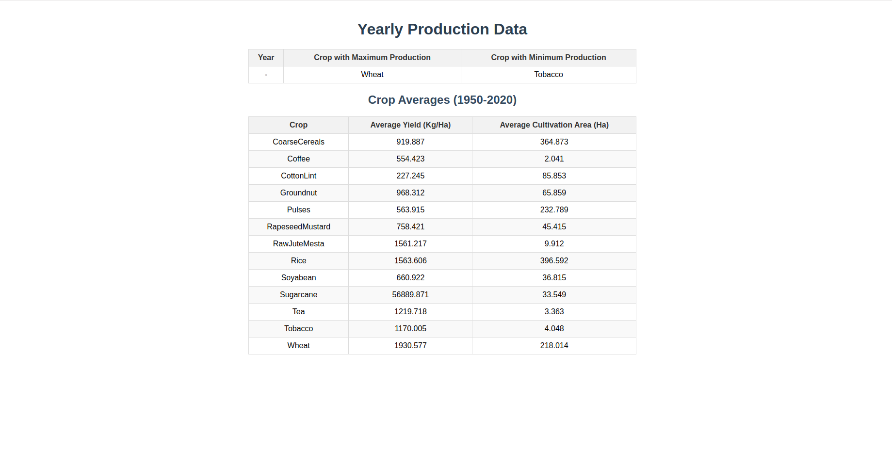

# Manufac Analytics - Agriculture Data Analysis

## Instructions

1. Clone the repository
2. Install dependencies with `yarn install`
3. Start the application with `yarn start`

## Screenshots

### Yearly Production Data


### Crop Averages (1950-2020)


## Final Directory Structure
```
manufac-analytics/
├── node_modules/
├── public/
│   ├── index.html
│   └── ...
├── src/
│   ├── dataProcessor.ts
│   ├── App.tsx
│   ├── index.tsx
│   └── ...
├── .gitignore
├── package.json
├── README.md
├── tsconfig.json
├── yarn.lock
└── Manufac_India_Agro_Dataset.json
```
